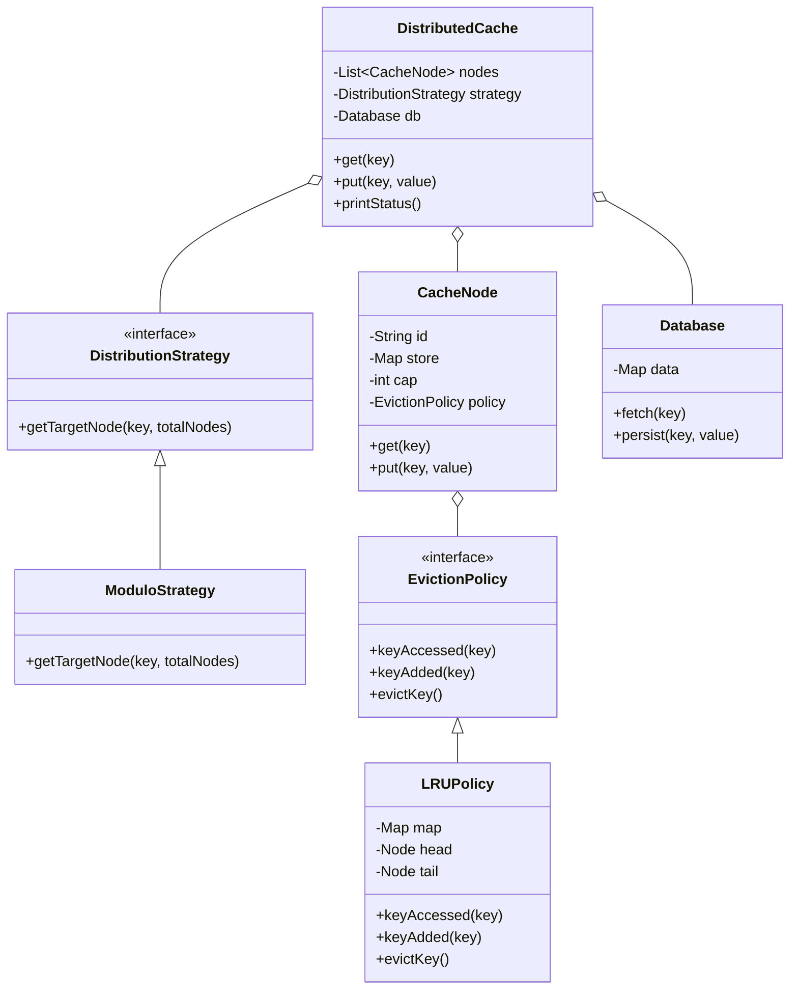

# Distributed Cache Design

This document explains the design and implementation of the distributed cache system.

## Class Diagram

## How Data is Distributed
Data is distributed across multiple nodes using the **Modulo-based distribution** strategy. 
1. We compute the `hashCode()` of the key string.
2. We take the absolute value of the hash and use the modulo operator (`%`) with the number of nodes.
3. This ensures that the same key always maps to the same cache node.

## Cache Miss Handling
When a `get(key)` is called:
1. The system determines which node the key should be in.
2. If the node finds the key, it returns the value (Cache Hit).
3. If the node doesn't have the key (Cache Miss), the `DistributedCache` coordinator calls the `Database` to fetch the value.
4. Once fetched, the value is stored in the cache node for future requests before being returned to the user.

## Eviction Policy
Each node has a limited capacity. When a node is full and a new key needs to be stored, the **LRU (Least Recently Used)** policy is used to evict a key.
- I implemented a custom **Doubly Linked List** to maintain the order of access.
- When a key is accessed, it moves to the head of the list.
- When eviction is needed, the key at the tail (the oldest one) is removed.
- This ensures $O(1)$ time complexity for both updates and evictions.

## Extensibility
The design uses interfaces (`DistributionStrategy` and `EvictionPolicy`) to allow future changes:
- You can plug in **Consistent Hashing** by implementing the `DistributionStrategy` interface.
- You can switch to **LFU** or **MRU** by implementing the `EvictionPolicy` interface and passing it to the `CacheNode`.
